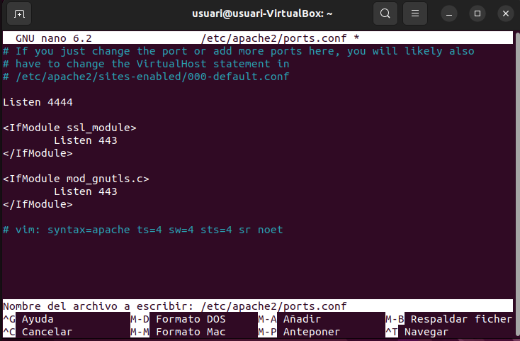
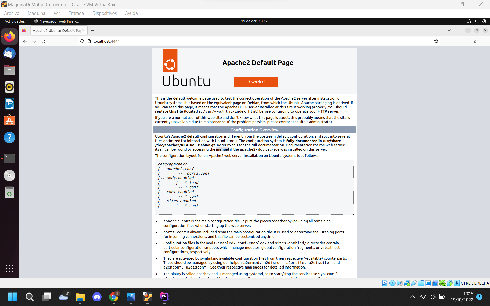

**1. Explique con sus palabras que es una petición GET, POST, PUT y DELETE,
   remarcando sus diferencias.**
   - GET: El método GET es utilizado para realizar una petición del servidor y esperar una respuesta a cambio, un valor, un dato, pero nunca podrá modificar valores, datos... del servidor, para ello utilizaremos los métodos POST, PUT, PATCH, DELETE.

   - POST: El método POST se utiliza para crear o agregar datos nuevos a un servidor, POST, normalmente se utiliza para agregar cosas nuevas, PUT, en cambio, para reemplazar datos ya existentes dentro del servidor, un ejemplo del uso del método POST, es cuando se envían los datos de los formularios HTML al servidor, a diferencia del método GET y HEAD, POST sí que permite cambiar el estado del servidor.

   - PUT: El método PUT se usa para actulizar un dato que se encuentre en el servidor, como ya he dicho anteriormente, por lo tanto se diferencia respecto al método POST en eso, este actualiza un recurso, y POST lo agrega o lo crea, de la misma forma que el método POST, el método PUT, puede cambiar el estado del servidor, cosa que los métodos GET y HEAD no.

   - DELETE: El método DELETE, se utiliza para eliminar un recurso que exista dentro del servidor, pueden cambiar el estado del servidor, como POST y PUT, y a diferencia de GET y HEAD. Este es un metodo idempotente lo que quiere decir que si una misma solicitud se lleva a cabo varias veces tendrá el mismo efecto dentro del servidor, no habrán efectos secundarios ni afectará al estado del servidor, está característica también la tienen los métodos PUT.

**2. Cambie del puerto 80 al puerto 4444 el servidor apache2. Muestra desde el navegador
   su funcionamiento adjuntando una captura de pantalla.**

Primero ejecutaremos la comanda "sudo nano /etc/apache2/ports.conf"

Editamos la línea Listen dónde había un 80, la primera de todas, y ponemos el número del puerto que deseamos.
Despues de editarlo habremos de reinicar el server, con la comanda "service apache2 restart"

Aquí podemos ver como funciona:

**3. Explica como activar, desactivar, reiniciar y recargar un servidor de Apache2
   explicando la diferencia entre cada uno de los comandos utilizados.**

Para activar el server de apache utilizaremos la siguiente comanda:

Para reiniciar el server de apache utilizaremos la siguiente comanda:

Para desactivar el server de apache utilizaremos la siguiente comanda:

Para recargar el server de apache utilizaremos la siguiente comanda:

Activar = inicia el servidor.

Reiniciar = detener + iniciar.

Recargar = seguir ejecutándose + volver a leer los archivos de configuración.

Detener = detiene el servidor.

**4. ¿Dónde se encuentran los ficheros de configuración de Apache2?**

Los ficheros de configuracion de apache2 se encuentran en: "/etc/apache2/apache2. conf"

**5. ¿Dónde se encuentran los ficheros de ejecución de Apache2?**

Los ficheros de configuracion de apache2 se encuentran en: "/usr/sbin/apache2"

**6. ¿Dónde se encuentran los ficheros de monitorización de Apache2?**

Los ficheros de configuracion de apache2 se encuentran en: "/var/log/apache2"

**7. ¿Qué es un Firewall? ¿Para que funciona? ¿Por qué es necesario?**

Los cortafuegos analizan cuidadosamente el tráfico entrante en función de reglas preestablecidas y filtran el tráfico procedente de fuentes no seguras o sospechosas para evitar ataques. Los cortafuegos protegen el tráfico en el punto de entrada de una computadora, llamados puertos, que es donde se intercambia información con dispositivos externos. Por ejemplo, "La dirección de origen 172.18.1.1 puede llegar al destino 172.18.2.1 a través del puerto 22", podemos decir que los cortafuegos nos permiten proteger el equipo de conexiones remotas no deseadas. Además, también se pueden definir excepciones para permitir las conexiones que se desee y se reconozcan como legítimas.

**8. Explica con tus palabras las diferentes partes de una URL.**

https://gimbernat.esemtia.net/moodle/pluginfile.php/15329/mod_resource/content/1/02_T2_Administracion_de_servidores_web.pdf

Lo primero que salga en una url será el protocolo que sigue, en el ejemplo que he puesto sería el https, lo que prosigue al protocolo siempre sera el anfitrion, es decir el host, en este caso, ://gimbernat.esemtia.net, en nuestro caso no sale el puerto, porque tiene por defecto el 80, y en el ejemplo todo lo que sigue es la ruta, si hubiese un interrogante ahí empezaria la consulta pero no lo hay. En cambio tiene un .pdf al final que indica la extension del archivo. 

**9. Explica el funcionamiento del protocolo HTTP.**

HTTP es un protocolo de capa de aplicación creado sobre TCP que utiliza un modelo de comunicación cliente-servidor. Los clientes y servidores HTTP se comunican a través de mensajes de solicitud y respuesta. Los tres tipos principales de mensajes HTTP son GET, POST y HEAD.

HTTP GET: los mensajes enviados a un servidor contienen solo una URL. Se pueden agregar cero o más parámetros de datos opcionales al final de la URL. El servidor procesa la porción de datos opcionales de la URL, si está presente, y devuelve el resultado (una página web o elemento de una página web) al navegador.
HTTP POST: los mensajes colocan los parámetros de datos opcionales en el cuerpo del mensaje de solicitud en lugar de agregarlos al final de la URL.
HTTP HEAD: las solicitudes funcionan igual que las solicitudes GET. En lugar de responder con el contenido completo de la URL, el servidor devuelve solo la información del encabezado (contenida dentro de la sección HTML).
Un mensaje HTTP GET.
El navegador inicia la comunicación con un servidor HTTP iniciando una conexión TCP con el servidor. Las sesiones de navegación web utilizan el puerto del servidor 80 de forma predeterminada, aunque a veces se utilizan otros puertos como el 8080.

Una vez que se establece una sesión, activa el envío y la recepción de mensajes HTTP visitando la página web.

HTTP es lo que se llama un sistema sin estado. Esto significa que, a diferencia de otros protocolos de transferencia de archivos como FTP, la conexión HTTP se interrumpe una vez que se completa la solicitud. Entonces, después de que su navegador web envíe la solicitud y el servidor responda con la página, la conexión se cierra.